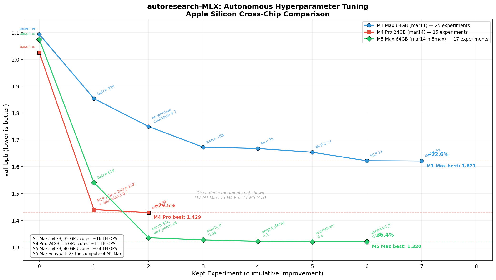

# autoresearch-MLX/MPS

Apple Silicon dual-backend port of [karpathy/autoresearch](https://github.com/karpathy/autoresearch) with full Muon optimizer support on both PyTorch MPS and MLX.



> **Latest results**: See the [experiment wiki](https://github.com/elementalcollision/autoresearch/wiki) for full details per chip.
>
> | Chip | Dataset | Date | Best val_bpb | Improvement |
> |------|---------|------|-------------|-------------|
> | **M5 Max** (64 GB) | [FineWeb-Edu](https://github.com/elementalcollision/autoresearch/wiki/FineWeb-Edu-Agent-Run-Mar-17-2026) | Mar 17 | **1.295** | −8.1% (101 experiments) |
> | **M5 Max** (64 GB) | [Climbmix](https://github.com/elementalcollision/autoresearch/wiki/Agent-Run-Mar-16-2026) | Mar 16 | **1.335** | −1.3% (81 experiments) |
> | **M5 Max** (64 GB) | [Climbmix](https://github.com/elementalcollision/autoresearch/wiki/Experiment-Results-Mar-15-2026-M5-Max) | Mar 15 | **1.320** | −36.4% (17 experiments) |
> | M4 Pro (24 GB) | [Climbmix](https://github.com/elementalcollision/autoresearch/wiki/Experiment-Results-Mar-14-2026-M4-Pro) | Mar 14 | 1.429 | −29.5% |
> | M1 Max (64 GB) | [Climbmix](https://github.com/elementalcollision/autoresearch/wiki/Experiment-Results-Mar-11-2026) | Mar 11 | 1.621 | −22.6% |
>
> **Cross-dataset finding**: Optimal hyperparameters are dataset-dependent. FineWeb-Edu converges to a half-width model (AR=32) running 2× more gradient steps, while climbmix keeps the full architecture. See the [Cross-Dataset Comparison](https://github.com/elementalcollision/autoresearch/wiki/Cross-Dataset-Comparison) for full analysis.

## What is this?

[Autoresearch](https://github.com/karpathy/autoresearch) is Karpathy's framework for autonomous AI-driven LLM training experiments. An AI agent modifies the training code, runs a 5-minute experiment, checks if results improved, keeps or discards, and repeats overnight.

The original requires an NVIDIA GPU (H100) with CUDA, FlashAttention-3, and `torch.compile`. This fork ports everything to Apple Silicon, supporting both **PyTorch MPS** and **MLX** backends. It runs on any Apple Silicon Mac from M1 to M5 Ultra — tested on M1 Max (64 GB), M4 Pro (24 GB), and M5 Max (64 GB), with the M5 Max achieving the best results thanks to its superior compute throughput and GPU Neural Accelerators.

### Key features

- **Dual backend**: PyTorch MPS and Apple MLX, auto-detected or manually selected
- **Full Muon optimizer on both backends**: Newton-Schulz (Polar Express) orthogonalization, Nesterov momentum, NorMuon variance reduction, cautious weight decay. The MLX port is a novel implementation that doesn't exist in any public fork.
- **Hardware auto-detection**: Identifies chip generation (M1-M5), tier (base/Pro/Max/Ultra), GPU core count, and memory. Scales hyperparameters accordingly.
- **Hardware-adaptive defaults**: Batch size, model depth, and total batch size tuned per chip tier
- **No CUDA dependencies**: Pure Apple Silicon. FlashAttention-3 replaced with PyTorch SDPA (MPS) and native attention (MLX).

## Quick start

**Requirements**: Apple Silicon Mac (M1 or later), Python 3.10+, [uv](https://docs.astral.sh/uv/)

```bash
# 1. Install uv (if needed)
curl -LsSf https://astral.sh/uv/install.sh | sh

# 2. Clone the repo
git clone https://github.com/elementalcollision/autoresearch.git
cd autoresearch

# 3. Install dependencies (pick your backend)
uv sync --extra mlx            # MLX only (recommended)
uv sync --extra mps            # PyTorch MPS only
uv sync --extra all            # Both backends

# 4. Download data and train tokenizer (one-time, ~2 min)
uv run prepare.py

# 5. Run a training experiment (~5 min)
uv run train_mlx.py            # MLX (recommended)
uv run train.py                # Auto-detect backend
```

## Backend selection

The system auto-detects the best backend (prefers MLX). Override with an environment variable:

```bash
# Auto-detect (default: prefers MLX)
uv run train.py

# Force MLX
AUTORESEARCH_BACKEND=mlx uv run train.py

# Force MPS
AUTORESEARCH_BACKEND=mps uv run train.py

# Run MLX directly
uv run train_mlx.py
```

Check your detected hardware and suggested config:

```bash
uv run -c "from backends import print_hardware_summary; print_hardware_summary()"
```

## TUI Dashboard & Agent Mode

A real-time terminal dashboard with autonomous LLM-driven experiment optimization.

```bash
uv sync --extra all                              # Install all dependencies

uv run dashboard.py                              # Single training run with live metrics
uv run dashboard.py --agent --tag my-run         # Autonomous experiment loop (requires API key)
uv run dashboard.py --agent --tag my-run --max 50 # Limit to 50 experiments
```

Agent mode requires an Anthropic API key — run `uv run dashboard.py --setup-key` for one-time setup via macOS Keychain.

See the [TUI Dashboard](https://github.com/elementalcollision/autoresearch/wiki/TUI-Dashboard) wiki page for panels, keybindings, credentials, agent mode details, and troubleshooting.

## Multi-Dataset Experiments

Run experiments across different training datasets to compare how optimal hyperparameters vary by data distribution.

```bash
uv run convert_dataset.py fineweb-edu            # Download + convert a dataset
uv run run_suite.py                              # Run the full multi-dataset sweep
uv run compare_datasets.py                       # Cross-dataset analysis + charts
```

**Available datasets**: climbmix (default), fineweb-edu, fineweb-edu-high, cosmopedia-v2, slimpajama, python-edu.

See the [Multi-Dataset Experiments](https://github.com/elementalcollision/autoresearch/wiki/Multi-Dataset-Experiments) wiki page for architecture, usage, and the [Cross-Dataset Comparison](https://github.com/elementalcollision/autoresearch/wiki/Cross-Dataset-Comparison) for analysis of how optimal configurations diverge across datasets.

## Project structure

```
dashboard.py            TUI dashboard entry point
run_suite.py            Multi-dataset experiment orchestrator
compare_datasets.py     Cross-dataset analysis and visualization
convert_dataset.py      Download and convert alternative datasets
prepare.py              Data prep, tokenizer, dataloader, evaluation (do not modify)
train.py                MPS training script + backend dispatch (agent modifies this)
train_mlx.py            MLX training script (agent modifies this)
program.md              Agent instructions for autonomous experiments
backends/
  __init__.py           Hardware detection, chip tier, hyperparameter suggestions
  muon_mps.py           Muon+AdamW optimizer for PyTorch MPS
  muon_mlx.py           Muon+AdamW optimizer for MLX (novel port)
tui/
  app.py                Textual Application, layout, subprocess management
  widgets.py            TrainingPanel, HardwarePanel, ExperimentsTable, ExperimentStatusPanel, ActivityLog
  orchestrator.py       Autonomous experiment loop (LLM → modify → train → evaluate → keep/discard)
  llm_backend.py        LLM abstraction: Claude API (Option A) + Ollama placeholder (Option B)
  credentials.py        API key resolution: env var → macOS Keychain → Claude Code credentials
  git_manager.py        Git operations: branch, commit, revert
  results.py            results.tsv read/write/history formatting for LLM prompts
  parser.py             Regex parser for training stdout (\r-delimited output)
  hardware.py           Apple Silicon hardware detection (chip, cores, memory, TFLOPS)
  experiments.py        results.tsv loader for TUI table display
  styles.tcss           CSS layout for panel styling
docs/
  evaluating-results.md Guide for noise floor estimation and Pareto efficiency
results/
  <dataset>/results.tsv Per-dataset experiment results
pyproject.toml          Dependencies with optional groups (mlx, mps, tui, agent, all)
```

**What the agent edits**: `train.py` (MPS) or `train_mlx.py` (MLX). Everything is fair game: architecture, optimizer settings, hyperparameters, batch size, model depth.

**What is fixed**: `prepare.py` (evaluation, data loading, constants), `backends/` (optimizer, hardware detection).

## Running autonomous experiments

Point your AI agent (Claude, Codex, etc.) at this repo and prompt:

```
Hi, have a look at program.md and let's kick off a new experiment! Let's do the setup first.
```

The agent reads `program.md`, establishes a baseline, then enters an autonomous loop: modify code, train 5 minutes, compare results, keep or discard, repeat. See `program.md` for full details.

## Hardware recommendations

### Auto-detected defaults (validated by characterization)

| Chip tier | Memory | Model depth | Device batch | Total batch |
|-----------|--------|-------------|-------------|-------------|
| Base (M1-M5) | 8-16 GB | 4 | 4 | 4K tokens |
| Pro | 18-36 GB | 6 | 8 | 8K tokens |
| Max | 36-128 GB | 8 | 16 | 32K tokens |
| Ultra | 64-192 GB | 10 | 32 | 64K tokens |

These defaults are calibrated from real characterization sessions across three chips. Larger batches cause memory-pressure swapping even on 64 GB machines — more gradient steps (smaller batches) consistently beats model capacity within the fixed 5-minute budget.

### Optimized results (after autonomous tuning)

| Chip | Memory | Best val_bpb | Optimized batch | Peak mem | Steps |
|------|--------|-------------|----------------|----------|-------|
| **M5 Max** | 64 GB | **1.320** | 32K total, 16 device | 26.1 GB | 312 |
| M4 Pro | 24 GB | 1.429 | 8K total, 4 device | 4.5 GB | 751 |
| M1 Max | 64 GB | 1.621 | 16K total, 8 device | 11.3 GB | ~210 |

**Key insight**: Maximizing optimizer steps within the fixed 5-minute time budget is the dominant factor across all chips. Each generation finds its own optimal batch size — M5 Max at 32K, M4 Pro at 8K, M1 Max at 16K — balancing gradient quality against step throughput.

## Differences from the original

| Feature | Original (CUDA) | This fork (Apple Silicon) |
|---------|-----------------|---------------------------|
| Attention | FlashAttention-3 | PyTorch SDPA (MPS) / native (MLX) |
| Compilation | `torch.compile` | Eager mode (MPS) / `mx.compile` (MLX) |
| Memory model | Discrete GPU VRAM | Unified CPU/GPU memory |
| MFU metric | Exact (known H100 FLOPS) | Approximate (estimated per-chip FLOPS) |
| Optimizer | Muon+AdamW (CUDA) | Muon+AdamW on both backends |
| Backends | Single (CUDA) | Dual (MPS + MLX) |
| Precision | bf16 via autocast | bf16 with manual casting (MPS) / native (MLX) |

## Output format

After a 5-minute run, the script prints:

```
---
val_bpb:          1.319639
training_seconds: 300.7
total_seconds:    398.4
peak_vram_mb:     26742.3
mfu_percent:      23.35
total_tokens_M:   10.2
num_steps:        312
num_params_M:     50.3
depth:            8
backend:          mlx
chip:             Apple M5 Max
```

The key metric is **val_bpb** (validation bits per byte) — lower is better. The example above is an actual run from the M5 Max optimized configuration.

## Technical notes

### MPS backend
- No `torch.compile` (not supported on MPS)
- All optimizer arithmetic done in float32 to avoid MPS mixed-dtype crashes
- Nesterov momentum uses explicit `mul_/add_` instead of `lerp_` (MPS dtype issue)
- Sliding window attention via manual mask + SDPA

### MLX backend
- Newton-Schulz orthogonalization uses `mx.swapaxes` for matrix transpose
- Gradient accumulation via `tree_map`
- Explicit `mx.eval()` calls for lazy evaluation control
- `nn.value_and_grad()` replaces PyTorch's `.backward()`
- Aggressive GC management (`gc.freeze()` after warmup) to minimize overhead

### Muon optimizer
The Muon optimizer combines Newton-Schulz orthogonalization (Polar Express) with Nesterov momentum, NorMuon variance reduction, and cautious weight decay. It is applied to 2D matrix parameters in transformer blocks, while embeddings and scalars use standard AdamW. The MLX implementation is a complete port of the original CUDA version, adapted for MLX's lazy evaluation model.

## Acknowledgments

- [Andrej Karpathy](https://github.com/karpathy/autoresearch) -- original autoresearch framework and design philosophy
- [miolini/autoresearch-macos](https://github.com/miolini/autoresearch-macos) -- reference MPS port
- [trevin-creator/autoresearch-mlx](https://github.com/trevin-creator/autoresearch-mlx) -- reference MLX port
- [Jordan Keller](https://kellerjordan.github.io/posts/muon/) -- Muon optimizer

## Upstream contributions

- [PR #205](https://github.com/karpathy/autoresearch/pull/205) — Self-contained Apple Silicon MLX backend submitted to [karpathy/autoresearch](https://github.com/karpathy/autoresearch). GPU-accelerated Newton-Schulz with float32 NaN fix, MLX-native dataloader and evaluation. Zero modifications to existing files.
- [PR #84](https://github.com/karpathy/autoresearch/pull/84) — Fix NaN loss not caught by fast-fail check *(merged)*
- [PR #162](https://github.com/karpathy/autoresearch/pull/162) — Guard against infinite loop when no training shards exist *(merged)*

## License

MIT
